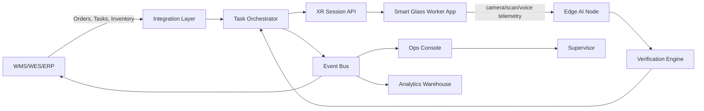

# System Architecture

## 논리 아키텍처

## 구성 요소
### Integration Layer
- WMS API, webhook, SFTP/CSV, EDI 연동
- 외부 WMS별 어댑터: Manhattan, SAP EWM, Oracle WMS, Blue Yonder, Dynamics 365, 자체 WMS
- 이벤트 표준화: 내부 `PickTaskAssigned`, `PickLineVerified`, `ExceptionRaised` 이벤트로 변환

### Task Orchestrator
- 작업 큐 관리
- SLA, 주문 마감, 존, 작업자 숙련도 기준 우선순위 계산
- 경로 최적화 및 피킹 모드 선택

### XR Session API
- 글래스 세션 상태 관리
- UI 카드 스트리밍
- 음성 명령 처리 결과 반영
- 작업자별 오프라인 캐시 패키지 생성

### Edge AI Node
- 카메라 프레임 프리프로세싱
- 바코드/QR 디코딩
- SKU 객체 탐지·분류
- 개인정보 최소화: 원본 영상 저장 비활성 기본값

### Verification Engine
- SKU, 로케이션, 수량, 토트, 포장 순서 검증
- 룰 기반 + AI 신뢰도 결합
- 고위험 케이스는 재스캔 또는 관리자 승인 플로우

### Ops Console
- 작업 상태, 오류 알림, 디바이스 상태, KPI
- 감사 로그 검색
- SKU/로케이션 리스크 분석

## 배포 패턴
| 패턴 | 설명 | 적합 고객 |
|---|---|---|
| Cloud SaaS + Edge Node | 중앙 SaaS + 창고 내 AI 엣지 장비 | 일반 3PL/이커머스 |
| Private Cloud | 고객 VPC에 전용 배포 | 대기업/규제 산업 |
| On-Prem Hybrid | WMS와 같은 망 내부에 핵심 컴포넌트 배치 | 보안 민감 창고 |
