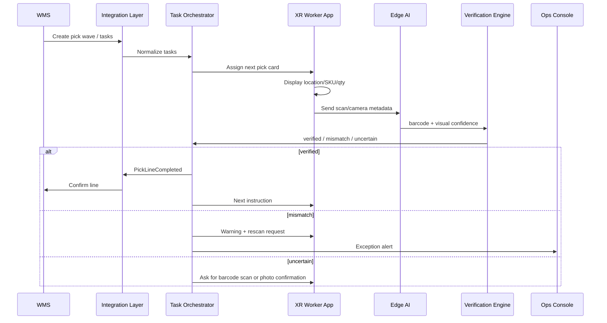

# Sequence — Pick & Verify Flow

```mermaid
sequenceDiagram
  participant WMS
  participant INT as Integration Layer
  participant ORCH as Task Orchestrator
  participant XR as XR Worker App
  participant EDGE as Edge AI
  participant VER as Verification Engine
  participant CON as Ops Console

  WMS->>INT: Create pick wave / tasks
  INT->>ORCH: Normalize tasks
  ORCH->>XR: Assign next pick card
  XR->>XR: Display location/SKU/qty
  XR->>EDGE: Send scan/camera metadata
  EDGE->>VER: barcode + visual confidence
  VER->>ORCH: verified / mismatch / uncertain
  alt verified
    ORCH->>INT: PickLineCompleted
    INT->>WMS: Confirm line
    ORCH->>XR: Next instruction
  else mismatch
    ORCH->>XR: Warning + rescan request
    ORCH->>CON: Exception alert
  else uncertain
    ORCH->>XR: Ask for barcode scan or photo confirmation
  end
```

## 성공 조건
- 작업자는 손을 멈추지 않고 다음 지시를 받는다.
- AI 신뢰도가 낮을 때는 자동 차단보다 재스캔/보조 검증으로 UX를 부드럽게 만든다.
- 모든 검증 결과는 감사 이벤트로 남지만, 원본 영상은 기본 저장하지 않는다.
